# adamacs_ingest

> **Live ADAMACS Documentation (Read the Docs):**  
> <https://adamacs-documentation.readthedocs.io>
>
> **Primary ADAMACS Documentation:**  
> <https://github.com/trose-neuro/adamacs_documentation>
>
> Use this as the canonical guide for setup, ingest GUI workflow, analysis links, schema chapters, infrastructure, and troubleshooting.

`adamacs_ingest` is the ingest-first ADAMACS repository.

Use this repo directly for day-to-day ingest and pipeline population. The ingest GUI remains the central user entrypoint, and ingest logic stays upstream in this repository (no routine fork required for students).

## Scope
- DataJoint pipeline activation and schemas (`adamacs/pipeline.py`, `adamacs/schemas/*`)
- Ingest and population logic (`adamacs/ingest/*`)
- Ingest GUI (`adamacs.gui.select_sessions`)
- Ingest notebooks and batch templates
- Shared lab defaults (`user_configs/`, `user_data/`)

## Repository map
- `adamacs/`: ingest package code
- `notebooks/`: renumbered ingest notebooks, including center-stage GUI workflow notebook
- `examples/batch_ingest/`: batch ingest templates by modality
- `docs/`: workflow, notebook index, split audit, batch example reference

## Installation

### One-stop install (recommended)
Run from repository root:

```bash
./scripts/install_datajoint_ingest.sh
```

Optional custom environment name:

```bash
./scripts/install_datajoint_ingest.sh my_ingest_env
```

The installer creates/updates a Python 3.11 conda env, verifies the interpreter is exactly 3.11, installs Graphviz, installs the pinned DataJoint pre-2.0 stack (`datajoint==0.14.8`), installs this package in editable mode, applies compatibility handling for `pywavesurfer` and `scanimage-tiff-reader`, and runs `pip check` to confirm dependency integrity.

### Manual install (same stack as script)
```bash
conda create -n datajoint_ingest python=3.11 -y
conda install -n datajoint_ingest -y graphviz
conda run -n datajoint_ingest python -m pip install --upgrade pip wheel "setuptools<81"
conda run -n datajoint_ingest python -m pip install -r requirements_datajoint_new.txt
conda run -n datajoint_ingest python -m pip install -e .
conda run -n datajoint_ingest python -m pip install --no-deps "pywavesurfer @ git+https://github.com/SFB1089/PyWaveSurfer.git"
conda run -n datajoint_ingest python -m pip install scanimage-tiff-reader==1.4.1.4
```

If `scanimage-tiff-reader` wheel build fails:
```bash
conda install -n datajoint_ingest -y -c conda-forge scanimage-tiff-reader
```

## DataJoint local configuration

1. Create a local config file from the template:
```bash
cp Example_dj_local_conf.json dj_local_conf.json
```

2. Edit `dj_local_conf.json` with your local database credentials and paths.

3. Confirm the file is not tracked:
```bash
git ls-files | grep -Ei '(^|/)dj_local_conf.*\.(json|joson)$|(^|/)dj_local_.*\.(json|joson)$'
```

This repository ignores `dj_local_conf.json` and typo variants like `dj_local_conf.joson` by default.

### TLS handshake troubleshooting
- Symptom: `SSLV3_ALERT_HANDSHAKE_FAILURE` during `dj.conn()` or `adamacs.pipeline` import.
- Cause: in DataJoint `0.14.x`, `database.use_tls: null` can trigger a TLS attempt.
- Fix: set `"database.use_tls": false` in your local `dj_local_conf.json` for non-TLS DB servers.
- Reminder: never commit `dj_local_conf.json`.

## Notebook parameters
Set these directly in the notebook parameter cell (no environment variables required).

- `ADAMACS_SESSION_FILTER`: glob for session folder names in ingest GUI workflow (`*` default).
- `ADAMACS_DATE_FILTER`: date filter for ingest GUI workflow. Supports `*`, exact date (`2025-01-20`), comparators (`>=2025-01-01`, `<2025-02-01`), inclusive range (`2025-01-01:2025-01-31`), plus legacy substring fallback (`2025-01`). Comparator tokens tolerate optional wildcard suffixes (for example `>2025-05-01*`).
- `ADAMACS_LAUNCH_GUI`: set to `True` to open interactive GUI (`False` default).
- `ADAMACS_MAX_JOB_ROWS`: row limit for cleanup templates (`50` default).
- `ADAMACS_INITIALS`: user initials filter in cleanup templates (`NK` default).
- `ADAMACS_DATE_FROM`: lower date bound for cleanup templates (`2025-01-01` default).

## Run ingest workflows

### GUI entrypoint (primary workflow)
```python
from adamacs.gui import select_sessions
select_sessions(["TR_WEZ-8701_2025-01-20_sessABC_scanXYZ"])
```

Center-stage notebook:
- `notebooks/00_ingest_gui_workflow_adamacs_ingest_v2.ipynb`

### Ingest notebooks
- Notebook index: `docs/NOTEBOOK_INDEX.md`
- These notebooks are ingest-facing and can write/populate tables.
- Includes adapted templates from original `tobiasr` ingest workflows and original notebook 20 cleanup intent.

### Batch ingest templates
- Templates: `examples/batch_ingest/`
- Usage guide: `docs/BATCH_INGEST_EXAMPLES.md`

## Student-first workflow
- Use upstream `adamacs_ingest` directly for routine ingest.
- Keep your local branch synced with upstream `main`.
- Open focused PRs upstream when ingest logic needs improvement.

Detailed steps: `docs/STUDENT_WORKFLOW.md`.

## `adamacs_analysis` class generation utility
If you also install `adamacs_analysis` in the same environment, you can scaffold missing DataJoint classes:

```bash
python -m pip install -e ../adamacs_analysis
adamacs-analysis-generate \
  --schema-name adamacs_analysis \
  --output generated/my_analysis_schema.py \
  --class TrialLevelMetrics:Computed \
  --class SubjectSummary:Manual
```

## Local checks and CI parity
```bash
python -m pip install pytest ruff
python -m ruff check --select E9,F63,F7,F82 adamacs tests examples
python -m pytest -q
```

CI runs lint and pytest on Python 3.11.

## Additional docs
- Split audit: `docs/SPLIT_AUDIT.md`
- Path migration: `MIGRATION.md`
- Tobiasr ingest adaptation map: `docs/TOBIASR_INGEST_ADAPTATION.md`
- Tobiasr full notebook catalog: `docs/TOBIASR_NOTEBOOK_CATALOG.md`
- Diagram setup and troubleshooting: `docs/DIAGRAM_SETUP.md`

## External references (component docs)
- DataJoint core: <https://docs.datajoint.com/core/datajoint-python/latest/>
- DataJoint Elements index: <https://docs.datajoint.com/elements/>
- Element Calcium Imaging: <https://docs.datajoint.com/elements/element-calcium-imaging/latest/>
- Element DeepLabCut: <https://docs.datajoint.com/elements/element-deeplabcut/latest/>
- Element Event concepts: <https://docs.datajoint.com/elements/element-event/0.2/concepts/>
- Suite2p docs: <https://suite2p.readthedocs.io/en/latest/>
- Suite2p parameters: <https://suite2p.readthedocs.io/en/latest/parameters/>
- Suite2p outputs: <https://suite2p.readthedocs.io/en/latest/outputs/>
- DeepLabCut docs: <https://deeplabcut.github.io/DeepLabCut/>
- DISK source: <https://github.com/bozeklab/DISK>
- CASCADE source: <https://github.com/HelmchenLabSoftware/Cascade>
- ADAMACS reference index:
  <https://github.com/trose-neuro/adamacs_documentation/blob/main/docs/common/external_references.md>

## Database Dependency Diagrams
These diagrams are generated from `notebooks/21_schema_dependency_diagrams.ipynb` using `dj.Diagram` and exported to `notebooks/schema_diagrams/`.
Each figure shows parent-child table dependencies for one schema domain.

### `subject`
Parent key root: `subject`
Animal-level metadata backbone. Defines stable subject identity, lab ownership, protocol context, and user/project linkage used by downstream session and recording tables.

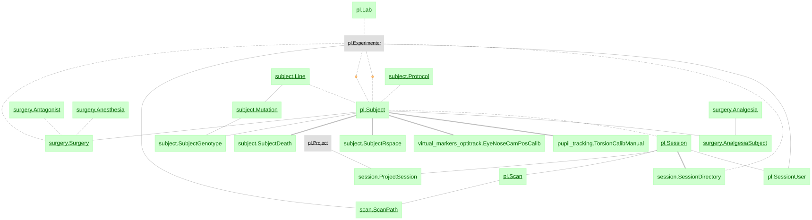

### `surgery`
Parent key root: `subject`
Implant and anatomical intervention history. Stores coordinate/site/procedure details that contextualize recording location and hardware constraints.

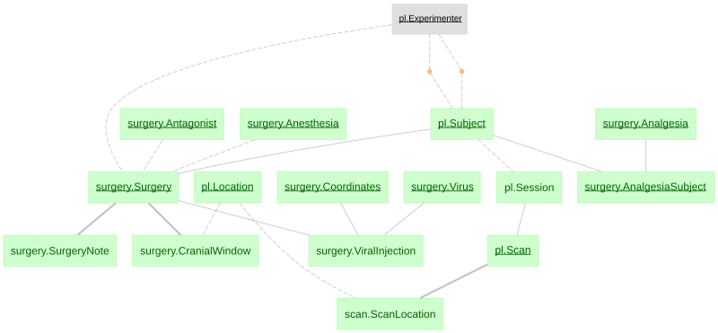

### `equipment`
Parent key root: `equipment/device`
Acquisition hardware and rig definitions. Normalizes scanner/camera/device metadata so ingest tasks can resolve hardware-specific parsing and processing parameters.

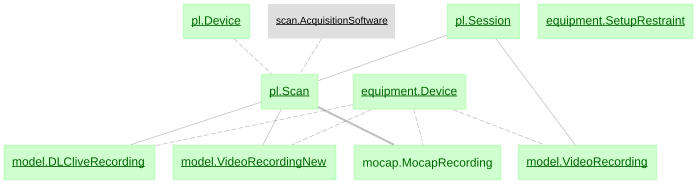

### `session`
Parent key root: `subject + session_id`
Session-level administrative and directory metadata. Connects subject identity to concrete acquisition sessions and links user ownership and storage paths.

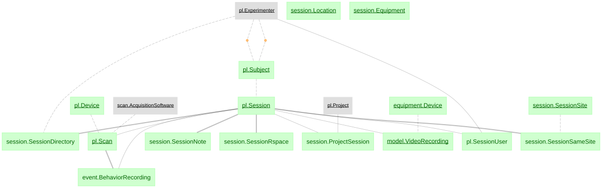

### `scan`
Parent key root: `session + scan_id`
Imaging scan-level ingestion metadata. Encodes scan paths, field information, imaging setup metadata, and identifiers used as central join keys across modalities.

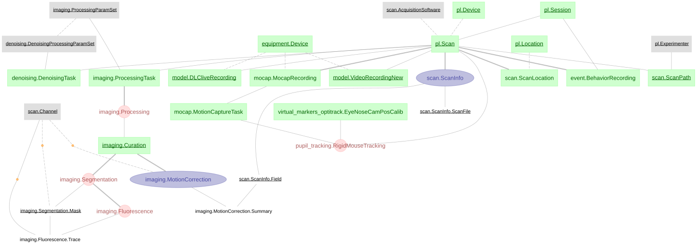

### `imaging`
Parent key root: `scan`
Calcium imaging processing outputs. Covers processing tasks, curation states, segmentation, fluorescence traces, and activity extraction products.

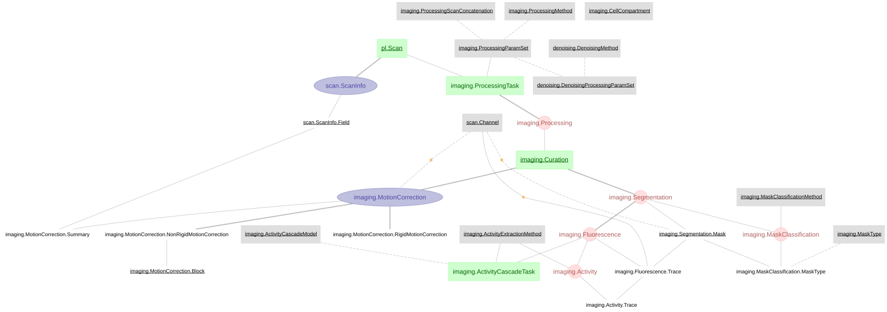

### `model`
Parent key root: `scan/session + recording_id`
DLC/model-based video processing stack. Tracks video recordings, model definitions, pose-estimation tasks, and inferred body-part trajectories.

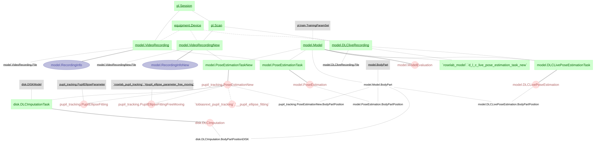

### `event`
Parent key root: `session/scan time axis`
Event timeline integration layer. Stores behavior recording references and event timestamps used to align neural, behavioral, and camera streams.

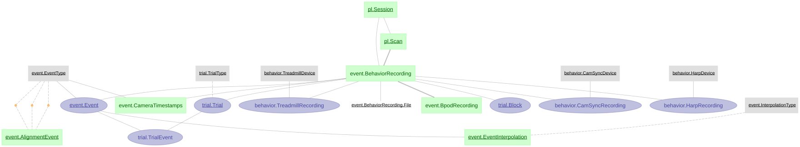

### `trial`
Parent key root: `session/scan + trial_id`
Trialization and behavioral epoch structure. Defines trial boundaries and trial-event anchors for task-level and latency analyses.

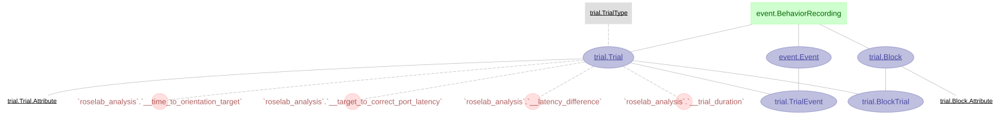

### `behavior`
Parent key root: `scan/session`
Behavioral stream ingestion outputs. Includes harp/treadmill/camera-sync channels and synchronized behavior-side continuous data products.

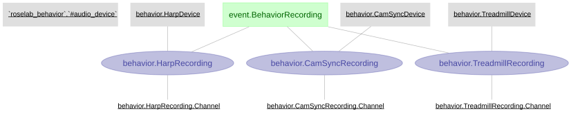

### `mocap`
Parent key root: `scan/session`
Raw motion-capture integration. Ingests and structures OptiTrack trajectories and timing needed for rigid-body and gaze reconstruction.

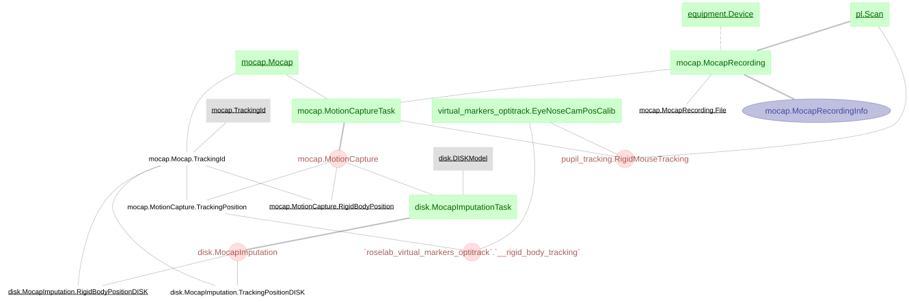

### `virtual_markers_optitrack`
Parent key root: `mocap + scan`
Derived rigid-body reconstruction layer. Builds virtual marker/head pose estimates from mocap inputs to support eye/head/world alignment.

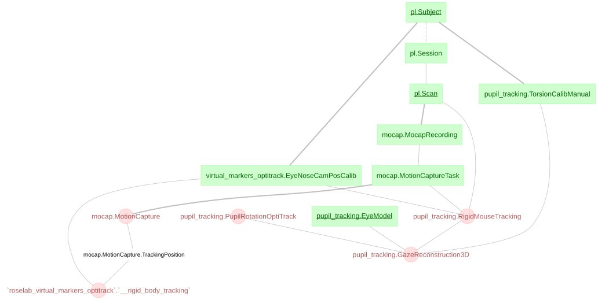

### `pupil_tracking`
Parent key root: `scan + eye recording`
Eye-camera and gaze-reconstruction outputs. Fits pupil ellipses, infers 3D gaze vectors, and links eye measurements with rigid-body orientation.

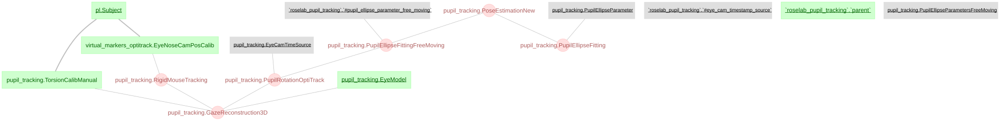

### `denoising`
Parent key root: `imaging processing output`
Post-processing denoising tasks for imaging outputs. Captures denoising parameterization and generated denoised signal products.

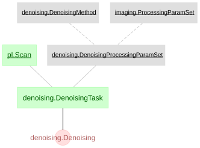

### `disk`
Parent key root: `scan/session storage`
Storage/indexing helpers for large artifacts. Tracks disk-side dataset products and intermediate outputs needed by ingest and post-processing routines.

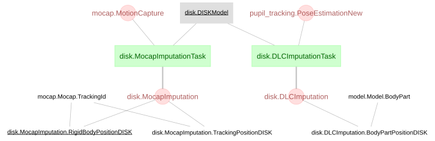
